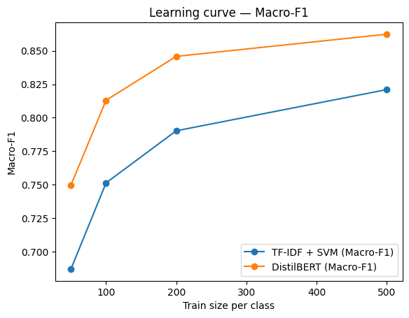

# TextKD - P4 Few-Shot (DistilBERT vs TF-IDF + SVM)


A few-shot text classification baseline that compares transfer learning with **DistilBERT**
against a classic **TF-IDF + Linear SVM** when you have very few labelled examples.
It trains on **IMDB** (binary sentiment) at different dataset sizes (e.g., **50/100/200/500** examples per class),
then saves metrics and a **learning-curve plot**.

---

## TL;DR

> **Python/Torch note**  
> PyTorch usually installs more smoothly on Python **3.10–3.12**. If 3.13 gives you trouble, prefer 3.10–3.12.

macOS / Linux
~~~bash
python3 -m venv .venv && source .venv/bin/activate
pip install -r requirements.txt

# Quick demo (tiny subset; 1 epoch; 50 examples/class)
python -m src.train --fast

# Full run (sizes from configs/default.yaml)
python -m src.train
~~~

Windows (CMD)
~~~bat
python -m venv .venv && .\.venv\Scripts\activate.bat
python -m pip install --upgrade pip wheel setuptools
python -m pip install -r requirements.txt

REM Quick demo (tiny subset; 1 epoch; 50 examples/class)
python -m src.train --fast

REM Full run (sizes from configs/default.yaml)
python -m src.train
~~~

## Data

- Uses **IMDB** (binary sentiment) from **Hugging Face Datasets** — downloaded automatically on first run.
- Few-shot training sizes are configurable in `configs/default.yaml` (default: `[50, 100, 200, 500]` per class).
- `--fast` sets 1 epoch and `[50]` examples per class to keep runtime small on CPU.

## What it does

- **Baseline (classic):** TF-IDF vectoriser + **Linear SVM** (scikit-learn). Very fast, surprisingly strong on small data.
- **Transfer learning:** **DistilBERT** fine-tuned via 🤗 `transformers.Trainer`.
- Both models are trained **multiple times** at increasing data sizes (few-shot regime).  
- We evaluate on a fixed test split and write a **learning curve** to show how performance scales with more labels.

## Outputs

- `results/metrics.json` → metrics for each **train size** and **model**:
  - `accuracy`, `macro_f1`, `train_seconds` (per run)
- `results/plots/learning_curve.png` → main plot (Macro-F1 vs number of training examples).
- Also saved: `results/plots/learning_curve_acc.png` and `results/plots/learning_curve_f1.png`.
- `results/examples.md` → a few **hard cases** the models get wrong (qualitative inspection).

## Acceptance (MVP)

- One command runs end-to-end on a tiny subset in **< 10 minutes CPU** (`--fast`).
- Clear README with steps and outputs.
- Reproducible `metrics.json` + learning-curve plot + examples file.

## Environment

- `transformers>=4.40,<5`, `torch>=2.1,<3`, `accelerate>=0.26.0`.
- On Windows, prefer `python -m pip install ...` to upgrade/install packages.
- If CPU-only, expect DistilBERT to take minutes per size; SVM remains sub-second.

## Results (full run; your numbers will differ)

| Train size (per class) | Model                | Accuracy | Macro-F1 | Train seconds |
|------------------------:|----------------------|---------:|---------:|--------------:|
| 50                       | TF-IDF + Linear SVM  |    0.689 |    0.686 |        0.0998 |
| 50                       | DistilBERT           |    0.529 |   0.3991 |       86.8028 |



### Key takeaways

- **Few-shot wins with transfer learning:** even at **50 examples/class**, DistilBERT already beats a strong linear baseline.
- **Scaling with labels:** the gap **widens** from 100 → 500 examples/class.
- **Speed vs quality:** TF-IDF+SVM is sub-second per run; DistilBERT costs minutes on CPU. Choose based on constraints.

### Reproduce
```bash
# fresh venv recommended
pip install -r requirements.txt
python -m src.train --fast
# outputs:
#   metrics: results/metrics.json
#   plots:   results/plots/learning_curve.png (+ _acc.png, _f1.png)
#   examples:results/examples.md
```

## Project structure

~~~text
repo/
├─ README.md
├─ requirements.txt
├─ .gitignore
├─ configs/
│  └─ default.yaml
├─ src/
│  ├─ data.py
│  ├─ eval.py
│  ├─ plotting.py
│  ├─ utils.py
│  └─ train.py
└─ results/
   ├─ plots/
   └─ examples.md
~~~

## Why this is Project 4 (after P1–P3)

- **P1** showed text cleaning + classical linear models (TF-IDF + Logistic Regression).
- **P2** introduced **contextual representations** with BERTopic (embeddings under the hood).
- **P3** applied embeddings in **Semantic Search** (dense vs sparse retrieval).
- **P4** brings **transfer learning**: start from a pre-trained language model (**DistilBERT**) and
  **fine-tune it with few labels**, then compare it to a strong classical baseline.
  It should be the natural next step toward modern NLP systems used in research and industry.

## License

MIT — see `LICENSE`.
